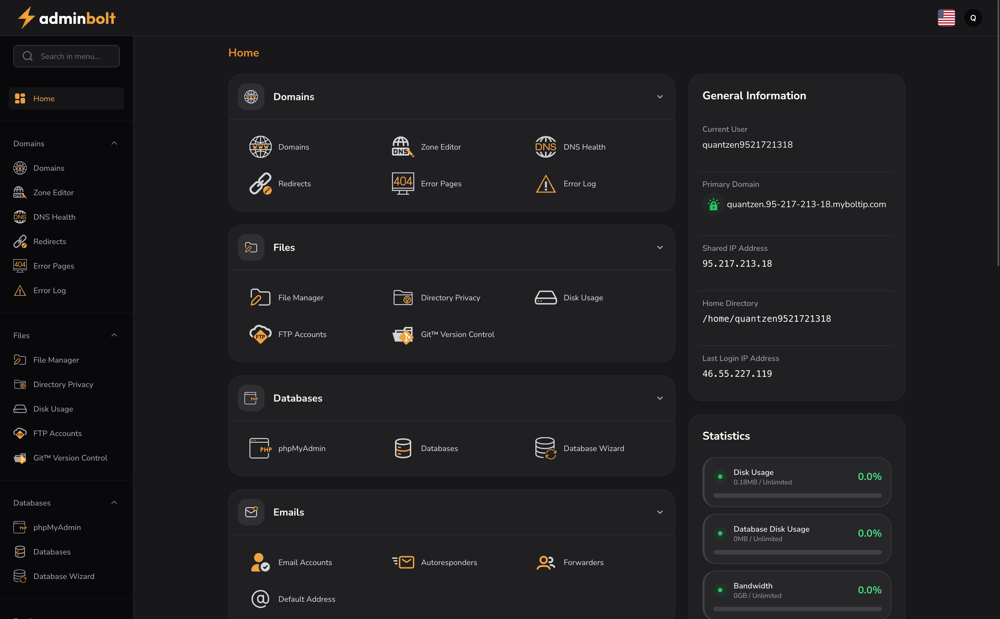
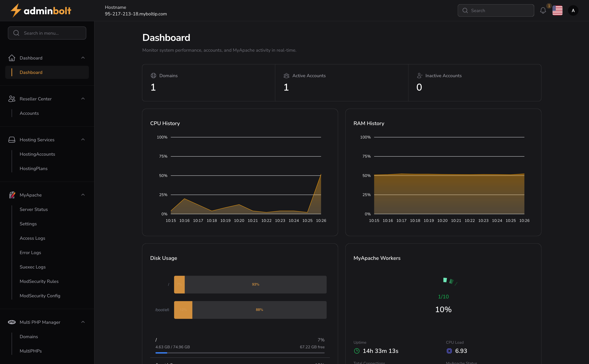
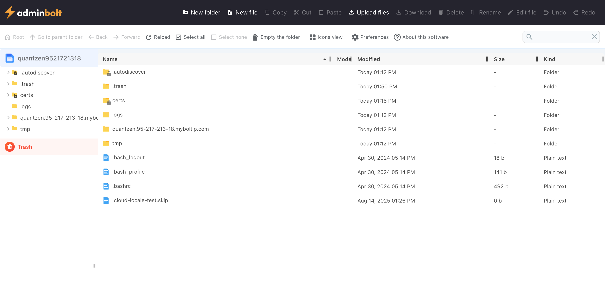
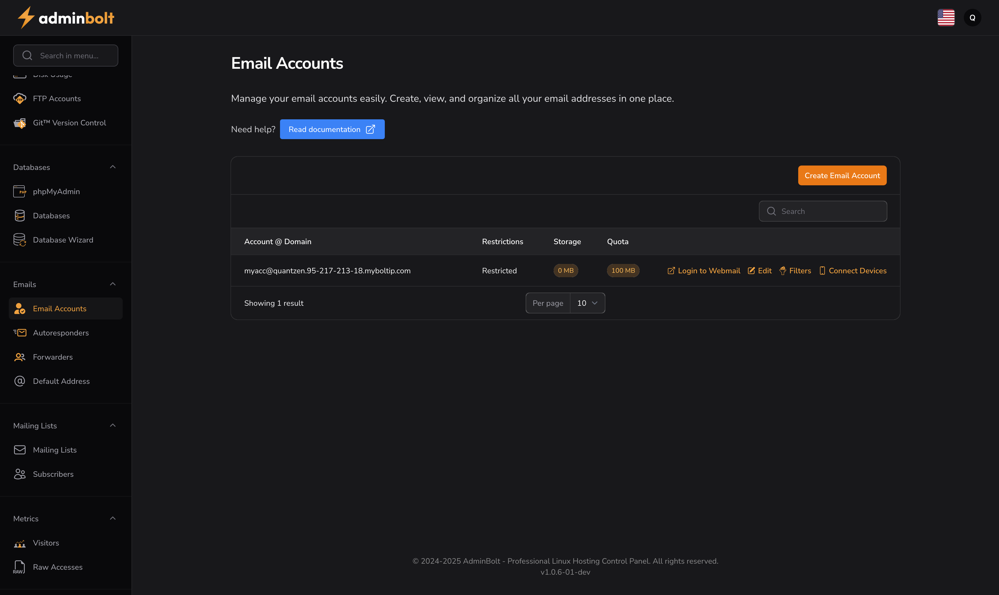

<div align="center">


**AdminBolt - The Modern Linux Shared Hosting Control Panel**

[](LICENSE)
[](https://adminbolt.com)
[](https://docs.adminbolt.com)
<!-- [](https://support.adminbolt.com) -->

[Features](#-features) • [Installation](#-installation) • [Screenshots](#-screenshots) • [Documentation](#-documentation) • [Support](#-support)

</div>



---

## 🌟 Overview

**AdminBolt** is a powerful, intuitive, and modern Linux shared hosting control panel designed to rival and surpass cPanel. Built with cutting-edge technology and a focus on user experience, AdminBolt provides hosting providers and system administrators with a familiar yet enhanced interface for managing web hosting environments.

### Why AdminBolt?

- 🎨 **Familiar Interface** - cPanel-like design that your users already know
- ⚡ **Lightning Fast** - Optimized performance with modern architecture
- 🔒 **Enterprise Security** - Built-in security features and regular updates
- 💰 **Cost Effective** - Competitive pricing without compromising on features
- 🛠️ **Easy Management** - Intuitive controls for hosting administrators
- 🌐 **Multi-Server Support** - Manage multiple servers from a single dashboard
- 📱 **Mobile Responsive** - Full functionality on any device
<!-- - 🔄 **Easy Migration** - Seamless migration from cPanel/Plesk -->

---

## ✨ Features

### 🎯 Core Features

#### Account Management
- **Multi-Domain Hosting** - Host multiple domains under one account
- **Subdomain Management** - Create and manage unlimited subdomains
- **Email Accounts** - Full-featured email management with spam filtering
- **FTP/SFTP Access** - Secure file transfer with user management
- **Database Management** - MySQL/MariaDB with phpMyAdmin

#### File Management
- **File Manager** - Web-based file manager with drag-and-drop support
- **Backup & Restore** - Automated and manual backup solutions
- **File Compression** - Support for ZIP, TAR, and GZ archives
- **Code Editor** - Built-in syntax-highlighted editor
- **Version Control** - Git integration for modern workflows

#### Developer Tools
- **Multiple PHP Versions** - Switch between PHP versions per domain
- **Cron Jobs** - Schedule automated tasks with ease
- **SSL/TLS Certificates** - Free Let's Encrypt integration + custom SSL
- **DNS Zone Editor** - Advanced DNS management
- **Git Integration** - Version control for your projects
- **Node.js Support** - 🔜 Coming 2026
- **Python Support** - 🔜 Coming 2026

#### Security Features
- **IP Blocker** - Protect your sites from malicious IPs
- **Password Protected Directories** - Add authentication to any folder
- **SSL/TLS Management** - Automated certificate provisioning
- **Security Scanner** - Real-time threat detection
- **Two-Factor Authentication** - Enhanced account security
- **Firewall Management** - Built-in firewall configuration

#### Server Administration
- **WHM-like Admin Panel** - Complete server management interface
- **Resource Monitoring** - Real-time CPU, RAM, and disk usage
- **Service Management** - Start, stop, and monitor services
- **Package Management** - Create and manage hosting packages
- **Reseller Support** - Multi-tier reseller functionality
- **API Access** - RESTful API for automation and integration

### 🎨 User Experience

- **Modern UI/UX** - Clean, intuitive interface based on cPanel's familiar layout
- **Dark Mode** - Eye-friendly dark theme option
- **Customizable Dashboard** - Arrange widgets to your preference
- **Quick Actions** - One-click access to common tasks
- **Search Functionality** - Find any feature instantly
- **Multi-Language Support** - Available in 20+ languages

### 📊 Monitoring & Analytics

- **Resource Usage Graphs** - Visual representation of server resources
- **Bandwidth Monitoring** - Track data transfer and usage
- **Error Logs** - Comprehensive logging and error tracking
- **Visitor Statistics** - Built-in analytics (AWStats/Webalizer)
- **Email Usage Reports** - Monitor email account activity

---

## 🚀 Installation

AdminBolt can be installed on a fresh Linux server in minutes with a single command.

### Quick Install

```bash
curl -sSL https://get.adminbolt.com/install.sh | bash
```

### System Requirements

#### Minimum Requirements
- **OS**: CentOS 7+, Ubuntu 20.04+, Debian 10+, AlmaLinux 8+, Rocky Linux 8+
- **CPU**: 2 cores
- **RAM**: 2 GB
- **Disk**: 20 GB free space
- **Network**: Public IP address

#### Recommended Requirements
- **OS**: AlmaLinux 9 or Rocky Linux 9
- **CPU**: 4+ cores
- **RAM**: 4+ GB
- **Disk**: 50+ GB SSD
- **Network**: 1 Gbps connection

### Supported Operating Systems

| Operating System | Versions | Status |
|-----------------|----------|---------|
| AlmaLinux | 9 | ✅ Supported |
| Rocky Linux | 8, 9 | 🔜 Coming 2026 |
| CentOS | 7, 8 Stream | 🔜 Coming 2026 |
| Ubuntu | 20.04, 22.04, 24.04 | 🔜 Coming 2026 |
| Debian | 10, 11, 12 | 🔜 Coming 2026 |

### Installation Steps

1. **Prepare Your Server**
   ```bash
   # Update your system
   sudo apt update && sudo apt upgrade -y  # For Debian/Ubuntu
   sudo dnf update -y                       # For RHEL/AlmaLinux/Rocky
   ```

2. **Run the Installer**
   ```bash
   curl -sSL https://get.adminbolt.com/install.sh | bash
   ```

3. **Follow the Interactive Prompts**
   - Set admin password
   - Configure hostname
   - Choose PHP versions
   - Select additional features

4. **Access Your Panel**
   ```
   https://your-server-ip:8443
   ```

### Installation Command

```bash
curl -sSL https://get.adminbolt.com/install.sh
```

For detailed installation instructions, see our [Installation Guide](https://docs.adminbolt.com/installation.html).

---

## 📸 Screenshots

<div align="center">

### Admin Dashboard


*Powerful administration dashboard with server overview and management tools*

---

### Client Dashboard


*Clean and intuitive client dashboard with quick access to all features*

---

### File Manager


*Advanced file manager with drag-and-drop support and code editor*

---

### Email Management


*Comprehensive email account management with spam filtering and webmail*

---

### Domain Statistics


*Detailed visitor statistics and analytics for your domains*

</div>

---

## 📚 Documentation

Comprehensive documentation is available to help you get the most out of AdminBolt:

- 📖 [User Guide](https://docs.adminbolt.com) - For end users
- 🛠️ [Administrator Guide](https://docs.adminbolt.com) - For server admins
- 🔌 [API Documentation](https://docs.adminbolt.com) - For developers
<!-- - 🎓 [Video Tutorials](https://docs.adminbolt.com/tutorials) - Step-by-step videos -->
<!-- - ❓ [FAQ](https://docs.adminbolt.com/faq) - Frequently asked questions -->

---

<!-- ## 🔄 Migration from cPanel

AdminBolt includes built-in migration tools to seamlessly transfer your hosting accounts from cPanel:

```bash
adminbolt migrate --from cpanel --source-server 192.168.1.100
``` -->

Features:
- ✅ Accounts and packages
- ✅ Websites and domains
- ✅ Databases (MySQL/MariaDB)
- ✅ Email accounts and filters
- ✅ DNS zones
- ✅ SSL certificates
- ✅ Cron jobs
- ✅ FTP accounts

<!-- [Read the Migration Guide](https://docs.adminbolt.com/migration/cpanel) -->

---

## 💡 Use Cases

### Hosting Providers
Perfect for web hosting companies looking to reduce licensing costs while providing a familiar interface to customers.

### System Administrators
Ideal for managing multiple websites and domains on a single server with enterprise-grade features.

### Resellers
Built-in reseller functionality allows you to create and manage sub-accounts with custom branding.

### Developers
Modern developer tools including Git integration, multiple PHP versions, and Node.js support.

### Enterprises
Secure, scalable solution for managing internal hosting infrastructure with advanced monitoring.


<!-- ## 🆚 AdminBolt vs cPanel

| Feature | AdminBolt | cPanel |
|---------|-----------|--------|
| **Pricing** | Starting at $X/month | Starting at $15+/month |
| **Interface** | Modern, familiar design | Traditional interface |
| **Performance** | Optimized, lightweight | Resource intensive |
| **Docker Support** | ✅ Native | ❌ Limited |
| **Git Integration** | ✅ Built-in | ⚠️ Plugin required |
| **Node.js Manager** | ✅ Built-in | ⚠️ Plugin required |
| **Python Manager** | ✅ Built-in | ⚠️ Limited |
| **API** | ✅ Modern RESTful | ✅ UAPI/API2 |
| **Mobile Responsive** | ✅ Fully responsive | ⚠️ Partially |
| **Dark Mode** | ✅ Yes | ❌ No |
| **Free SSL** | ✅ Let's Encrypt | ✅ AutoSSL |
| **Migration Tools** | ✅ Free | 💰 Paid | -->

---

## 🎯 Roadmap

### Current (2025)
- [x] Core panel functionality
- [x] Email management
- [x] Database management
- [x] File manager
- [x] Multiple PHP versions
- [x] SSL/TLS management
- [x] AlmaLinux 9 support

### 2026 Roadmap
- [ ] Additional OS support (Rocky Linux, Ubuntu, Debian, CentOS)
- [ ] Node.js application manager
- [ ] Python environment manager
- [ ] Advanced security dashboard
- [ ] Multi-server clustering
- [ ] Advanced analytics

---

## 💼 Enterprise Solution

AdminBolt is a proprietary enterprise hosting control panel. We focus on providing a stable, secure, and feature-rich platform for hosting providers.

For feature requests and feedback, please contact our team at contact@adminbolt.com.

---

## 🔐 Security

Security is our top priority. If you discover a security vulnerability, please email contact@adminbolt.com. 

For more information, see our [Security Policy](SECURITY.md).

---

## 📝 License

AdminBolt is proprietary software. See [LICENSE](LICENSE) for details.

For licensing inquiries, contact contact@adminbolt.com.

---

## 💬 Support

### Support Resources
- 💬 [Community Forum](https://community.adminbolt.com)
- 💬 [Discord Community](https://discord.com/invite/WbYw3fsu)
- 📚 [Documentation](https://docs.adminbolt.com)
- 💳 [Billing Portal](https://billing.adminbolt.com)

### Commercial Support
- 📧 Email: support@adminbolt.com
- 🎫 Support tickets via billing portal

<!-- ### Professional Services
- 🚀 Migration Services
- 📚 Training and Onboarding
- 🏢 Enterprise Support -->

Contact: contact@adminbolt.com

---

## 🌐 Links

- **Website**: [https://adminbolt.com](https://adminbolt.com)
- **Documentation**: [https://docs.adminbolt.com](https://docs.adminbolt.com)
- **Community Forum**: [https://community.adminbolt.com](https://community.adminbolt.com)
- **Discord Community**: [https://discord.com/invite/WbYw3fsu](https://discord.com/invite/WbYw3fsu)
- **Billing Portal**: [https://billing.adminbolt.com](https://billing.adminbolt.com)

---

## 🎯 Focus

AdminBolt is focused on providing enterprise-grade hosting control panel solutions for professional hosting providers. Our platform is designed for stability, security, and ease of use.

---

<div align="center">

**Made with ❤️ by the AdminBolt Team**

[Get Started Now](https://adminbolt.com) | [Request Demo](https://adminbolt.com/) | [View Pricing](https://billing.adminbolt.com)

</div>

